# The Spiderweb: Network Map

This diagram visualizes the confirmed connections between Jeffrey Epstein and the various power centers of the world.

> **Note**: If the diagram below does not render, your Markdown viewer may not support Mermaid. See the [text version](#text-version) below the diagram.

```mermaid
graph LR
    JE((Jeffrey Epstein))
    GM((Ghislaine Maxwell))

    JE --- GM

    subgraph Inner Circle
        JLB[Jean-Luc Brunel]
        SK[Sarah Kellen]
        NM[Nadia Marcinkova]
        LG[Lesley Groff]
        AR[Adriana Ross]
        DS[Daniel Siad]
    end

    JE --- JLB
    JE --- SK
    JE --- NM
    JE --- LG
    JE --- AR
    JE --- DS

    subgraph Money and Law
        LW[Les Wexner]
        SH[Steven Hoffenberg]
        JS[Jes Staley]
        LB[Leon Black]
        DI[Darren Indyke]
        RK[Richard Kahn]
        JPM[JPMorgan Chase]
        DB[Deutsche Bank]
    end

    JE --- LW
    JE --- SH
    JE --- JS
    JS --- JPM
    JE --- LB
    JE --- DI
    JE --- RK
    JE --- DB

    subgraph Politics and Royalty
        BC[Bill Clinton]
        DT[Donald Trump]
        PA[Prince Andrew]
        PM[Peter Mandelson]
        KR[Kathryn Ruemmler]
        SB[Steve Bannon]
        HL[Howard Lutnick]
        ML[Miroslav Lajcak]
        EB[Ehud Barak]
    end

    JE --- BC
    JE --- DT
    JE --- PA
    GM --- PA
    JE --- PM
    JE --- KR
    JE --- SB
    JE --- HL
    JE --- ML
    JE --- EB

    subgraph Science and Tech
        JB[John Brockman]
        BG[Bill Gates]
        EM[Elon Musk]
        RH[Reid Hoffman]
        SBr[Sergey Brin]
        NC[Noam Chomsky]
        PAt[Peter Attia]
        DK[Dean Kamen]
    end

    JE --- JB
    JB --- BG
    JE --- BG
    JE --- EM
    JE --- RH
    JE --- SBr
    GM --- SBr
    JE --- NC
    JE --- PAt
    JE --- DK

    subgraph Media and Hollywood
        BR[Brett Ratner]
        ST[Steve Tisch]
        RBr[Richard Branson]
        WA[Woody Allen]
        DBl[David Blaine]
    end

    JE --- BR
    JLB --- BR
    JE --- ST
    JE --- RBr
    JE --- WA
    JE --- DBl

    subgraph Survivors
        VG[Virginia Giuffre]
        MF[Maria Farmer]
        SR[Sarah Ransome]
        CW[Courtney Wild]
    end

    GM --- VG
    JE --- VG
    JE --- MF
    JE --- SR
    JE --- CW

    subgraph Key Evidence
        FL[Flight Logs]
        BB[Black Book]
        TP[The Tapes]
        EML[18700 Emails]
    end

    BC -.-> FL
    DT -.-> FL
    PA -.-> FL
    SB -.-> TP
    PM -.-> EML
    EM -.-> EML

    style JE fill:#ff6666,stroke:#333,stroke-width:4px,color:#000
    style GM fill:#ff6666,stroke:#333,stroke-width:3px,color:#000
    style JLB fill:#ff9999,stroke:#333,color:#000
    style SK fill:#ff9999,stroke:#333,color:#000
    style NM fill:#ff9999,stroke:#333,color:#000
    style PM fill:#d8b4fe,stroke:#333,color:#000
    style SB fill:#d8b4fe,stroke:#333,color:#000
    style HL fill:#d8b4fe,stroke:#333,color:#000
    style ML fill:#d8b4fe,stroke:#333,color:#000
    style EB fill:#d8b4fe,stroke:#333,color:#000
    style BR fill:#d8b4fe,stroke:#333,color:#000
    style SBr fill:#d8b4fe,stroke:#333,color:#000
    style DK fill:#d8b4fe,stroke:#333,color:#000
    style SH fill:#ffcccc,stroke:#333,color:#000
    style JB fill:#bbf7d0,stroke:#333,color:#000
    style JPM fill:#fef08a,stroke:#333,color:#000
    style DB fill:#fef08a,stroke:#333,color:#000
    style VG fill:#93c5fd,stroke:#333,color:#000
    style MF fill:#93c5fd,stroke:#333,color:#000
    style SR fill:#93c5fd,stroke:#333,color:#000
    style CW fill:#93c5fd,stroke:#333,color:#000
```

## How to Read This

- **Solid Lines**: Confirmed direct relationship (financial, social, or documented meetings).
- **Dotted Lines**: The primary evidence linking them to the case.
- **Colors**:
  - **Red**: Charged/Convicted/Deceased (Epstein, Maxwell, Brunel, Kellen, Marcinkova).
  - **Purple**: 2026 Key Revelations (Mandelson, Bannon, Lutnick, Lajcak, Barak, Ratner, Brin, Kamen).
  - **Blue**: Survivors/Victims (Giuffre, Farmer, Ransome, Wild).
  - **Yellow**: Banks (JPMorgan, Deutsche Bank).
  - **Pink**: Historical Fraud (Hoffenberg / Towers Financial).
  - **Green**: Science Connector (Brockman / Edge Foundation).

---

## Text Version

For viewers without Mermaid support, here is the network as a structured list:

### Jeffrey Epstein (Center)

**Partner**: Ghislaine Maxwell

**Inner Circle** (Convicted/Immunity):
- Jean-Luc Brunel (modeling agent; deceased 2022)
- Sarah Kellen (scheduler; immunity)
- Nadia Marcinkova (pilot; immunity)
- Lesley Groff (assistant; immunity)
- Adriana Ross (recruiter; immunity)
- Daniel Siad (Polish "scout")

**Money & Law**:
- Les Wexner (patron; $0 townhouse; power of attorney)
- Steven Hoffenberg (mentor; Towers Financial Ponzi)
- Jes Staley (JPMorgan banker; "Snow White" emails)
- Leon Black ($158M in payments; Apollo Global)
- Darren Indyke & Richard Kahn (estate executors; 1953 Trust)
- JPMorgan Chase ($290M settlement) / Deutsche Bank ($75M settlement)

**Politics & Royalty**:
- Bill Clinton (26+ flights; no victim accusations)
- Donald Trump (social ties 1990s; rift ~2004; 8 flights)
- Prince Andrew (accused; settled; Buckingham Palace emails)
- Peter Mandelson (UK state secrets; criminal investigation)
- Kathryn Ruemmler (Obama WH Counsel; "adoration" emails)
- Steve Bannon (15hr interviews; Trump-mocking texts)
- Howard Lutnick (Trump Commerce Sec.; 2012 island visit)
- Miroslav Lajcak (Slovak official; resigned Jan 31, 2026)
- Ehud Barak (Former Israeli PM; apartment stays; FBI Mossad memo)

**Science & Tech**:
- John Brockman (Edge Foundation; broker to scientists)
- Bill Gates (post-conviction meetings; "I was foolish")
- Elon Musk (16 emails; "wildest party"; island visits planned)
- Reid Hoffman (LinkedIn; island fundraising trip)
- Sergey Brin (Google; Maxwell communications; dinner lists)
- Noam Chomsky ($270k transfers)
- Peter Attia (longevity doctor; 1,700 emails)
- Dean Kamen (Segway; island visitor; FIRST leave)

**Media & Hollywood**:
- Brett Ratner (Melania director; couch photos)
- Steve Tisch (NY Giants; "pro or civilian" emails)
- Richard Branson (Virgin; "bring your harem" email)
- Woody Allen (social ties confirmed)
- David Blaine (dinner party performances)

**Survivors**:
- Virginia Giuffre (deceased 2025; forced files open)
- Maria Farmer (first whistleblower, 1996)
- Sarah Ransome (escape artist)
- Courtney Wild (Florida victims' voice)

**Key Evidence Chains**:
- Clinton, Trump, Andrew --> Flight Logs
- Bannon --> 15-hour interview tapes
- Mandelson, Musk --> 18,700+ emails
- All --> Black Book (1,000 names)

## See Also

- [Profiles Directory](../profiles/README.md) - Full list of all profiles
- [2026 Release](../evidence/2026_Release.md) - Document details
- [Flight Logs vs. Black Book](../evidence/Logs_vs_Book.md) - Understanding the evidence types
