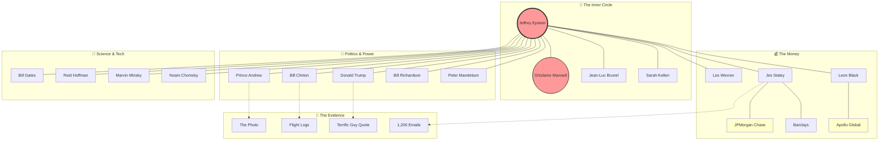

# 🕸️ The Spiderweb: Network Map

This diagram visualizes the confirmed connections between Jeffrey Epstein and the various power centers of the world.

## How to Read This
*   **Solid Lines**: Confirmed direct relationship (financial, social, or documented meetings).
*   **Dotted Lines**: The primary evidence linking them.
*   **Colors**:
    *   **Red**: Charged/Convicted.
    *   **Yellow**: Financial Institutions.
